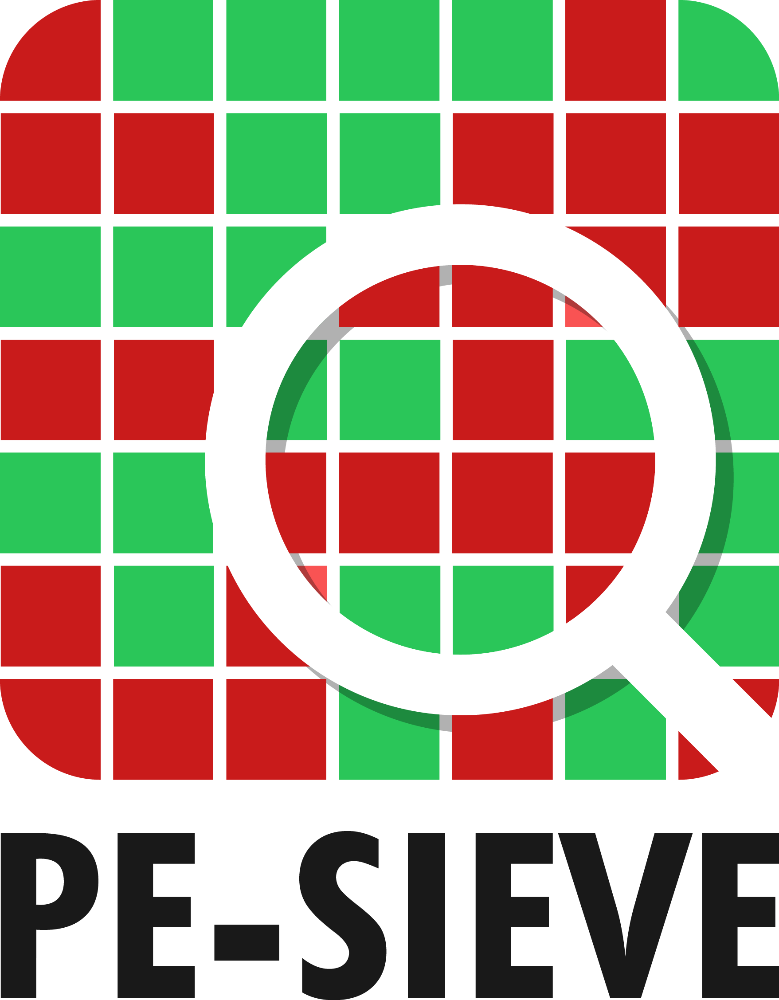

 

<b>PE-sieve</b> is a tool that helps to detect malware running on the system, as well as to collect the potentially malicious material for further analysis. Recognizes and dumps variety of implants within the scanned process: replaced/injected PEs, shellcodes, hooks, and other in-memory patches. 
Detects inline hooks, Process Hollowing, Process Doppelgänging, Reflective DLL Injection, etc.

PE-sieve is meant to be a **light-weight engine** dedicated to scan **a single process** at the time. It can be built as an EXE or as a DLL. The DLL version exposes a simple API and can be easily integrated with other applications.

If instead of scanning a particular process you want to scan your **full system** with PE-sieve, you can use [HollowsHunter](https://github.com/hasherezade/hollows_hunter). It contains PE-sieve (a DLL version), but offers also some additional features and filters on the top of this base.

Uses library:
https://github.com/hasherezade/libpeconv.git

[FAQ - Frequently Asked Questions](https://github.com/hasherezade/pe-sieve/wiki/1.-FAQ)

Clone:
-
Use recursive clone to get the repo together with the submodule:
<pre>
git clone --recursive https://github.com/hasherezade/pe-sieve.git
</pre>

Latest builds*:
-
*those builds are available for testing and they may be ahead of the official [release](https://github.com/hasherezade/pe-sieve/releases):
+ [32-bit](https://goo.gl/PnM3U2)
+ [64-bit](https://goo.gl/scP1Hi)

Read more:
-
Wiki: https://github.com/hasherezade/pe-sieve/wiki

logo by [Baran Pirinçal](https://github.com/baranpirincal)
